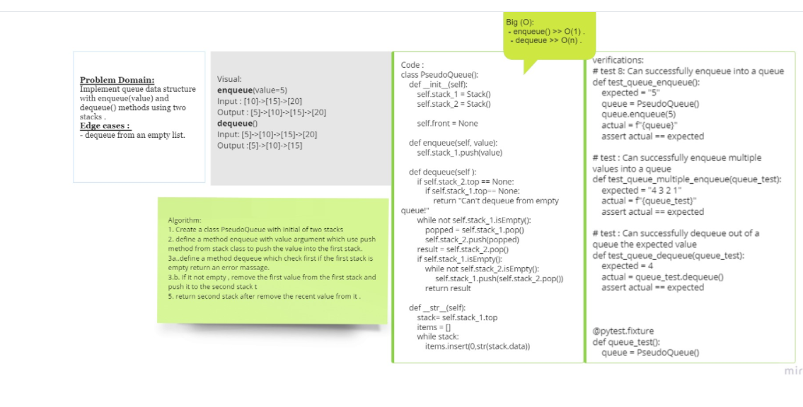

# Challenge Summary
PseudoQueue by Implement a Queue using two Stacks

## Whiteboard Process

## Approach & Efficiency
Enqueue O(1)
Dequeue O(n)

## Solution

[Challenge 11 - stack-queue-pseudo](./stack_queue_pesudo.py)

