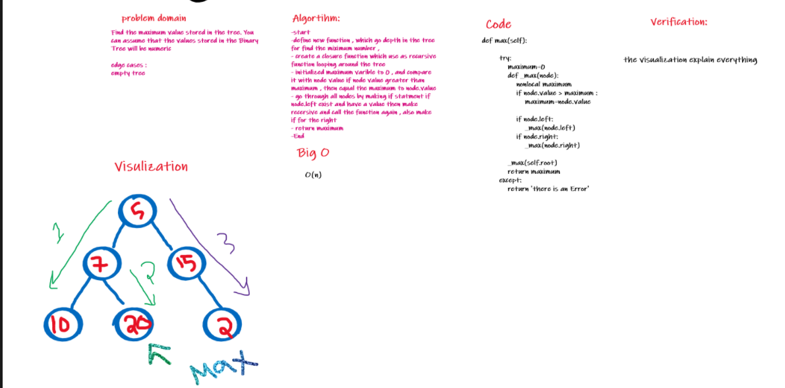

# Challenge Summary

Find maximum Number at tree
Find the maximum value stored in the tree. You can assume that the values stored in the Binary Tree will be numeric.

## Whiteboard Process

## Approach & Efficiency
[Challenge 16 - tree-max](./tree_max.py)

## Solution

[Challenge 16- tree-max](stack_and_queue.py)