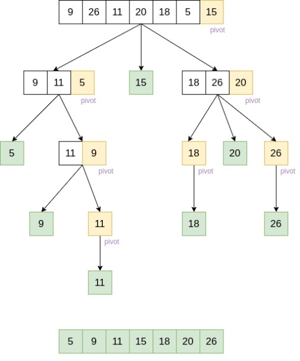

# **quick_sort**
## **solution**

### we start from the leftmost element and keep track of index of smaller (or equal to) elements as i. While traversing, if we find a smaller element, we swap current element with arr[i]. Otherwise we ignore current element.

# Pesudo code:

```
ALGORITHM quick_sort(arr, left, right):
    if left < right:
        position = partition(arr, left, right)
        quick_sort(arr, left, position - 1)
        quick_sort(arr, position + 1, right)

ALGORITHM partition(arr, left, right):
    pivot = arr[right]
    low = left - 1
    for i in range(left,right):
        if arr[i] <= pivot:
            low +=1
            swap(arr, i, low)

    swap(arr, right, low+1)
    return low + 1

ALGORITHM Swap(arr, i, low)
    DEFINE temp;
    temp=arr[i]
    arr[i] = arr[low]
    arr[low] = temp
```
## Sample list =[8,4,23,42,16,15]
#### Pass 1:
* pivot =15
* first sub list which contain the numbers less than 15 >> [8,4]
* Second sub list which contain the numbers larger than 15>>[23,42,16]

#### Pass 2:
* pivot = 4
* 4 swap with 8
* [4,8,15,23,42,16]

#### Pass 3:
* pivot =16
* first sub list which contain the numbers less than 16  >> [4,8,15]
* Second sub list which contain the numbers larger than 16 >> [23,42]

### Pass 4:
* the list is sorted[4,8,15,16,23,42]

