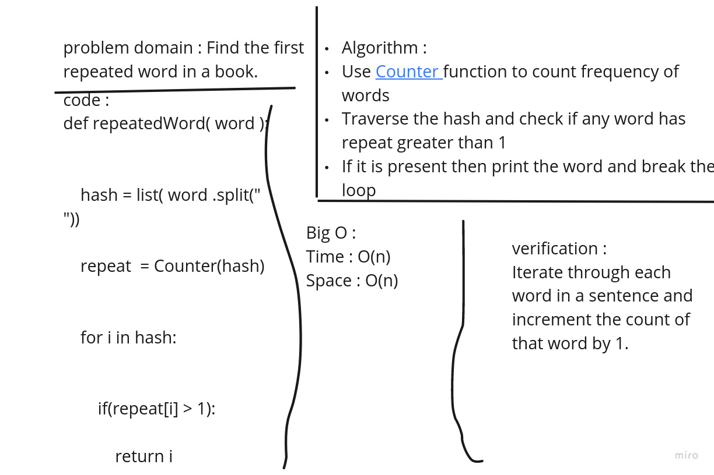

# Challenge Summary
Find the first repeated word in a string

## Whiteboard Process
https://miro.com/app/board/o9J_lyoaHY0=/ 
 

## Approach & Efficiency
Time : O(n) 
Space : O(n)

## Solution

from collections import Counter
 
'''''
Write a function called repeated word that finds the first word to occur more than once in a string
'''''
def  repeatedWord( word ):
 
   
    hash = list( word .split(" "))
   
    repeat  = Counter(hash)
     
   
    for i in hash:
       
         
        if(repeat[i] > 1):
           
            return i

Input : "Once upon a time, there was a brave princess who..."
Output :"a"

